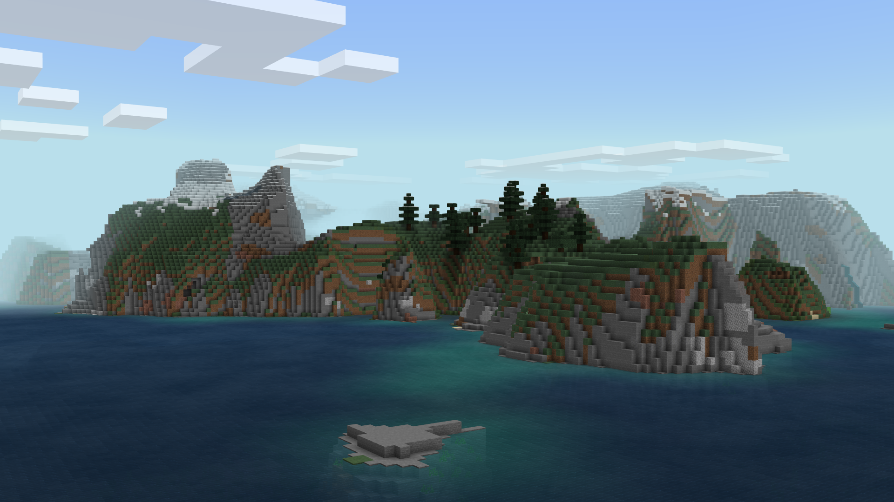

<table>
  <tr>
    <td>
      
    </td>
    <td>
      <h1>Landscapes</h1>
    </td>
  </tr>
</table>

Landscapes is a resource pack that modifies the appearances of various natural, agricultural, and architectural blocks to follow a more differentiating design language! All of the changes made by this pack are made by changing what textures blocks use, what colors are applied to them, and whether their textures should rotate. This means this pack can be used in conjunction with any other resource packs you wish!

* Support for Bedrock Edition
* Support for Java Edition
* Designed to work in conjunction with all resource packs

You can share this resource pack, but please refer others to the official [MCPEDL post](https://mcpedl.com/landscapes/), or this GitHub Repository only.

Feel free to include Landscapes in your own resource pack! My only requests are for a mention of my username, "Offroaders123", and a link back to either this MCPEDL post, my MCPEDL profile, this GitHub Repository, or my GitHub profile. Thanks!

Found a bug? Have a feature suggestion? Feel free to [contact me by email](mailto:offroaders123@gmail.com), or submit a new issue to this GitHub Repository!

---

